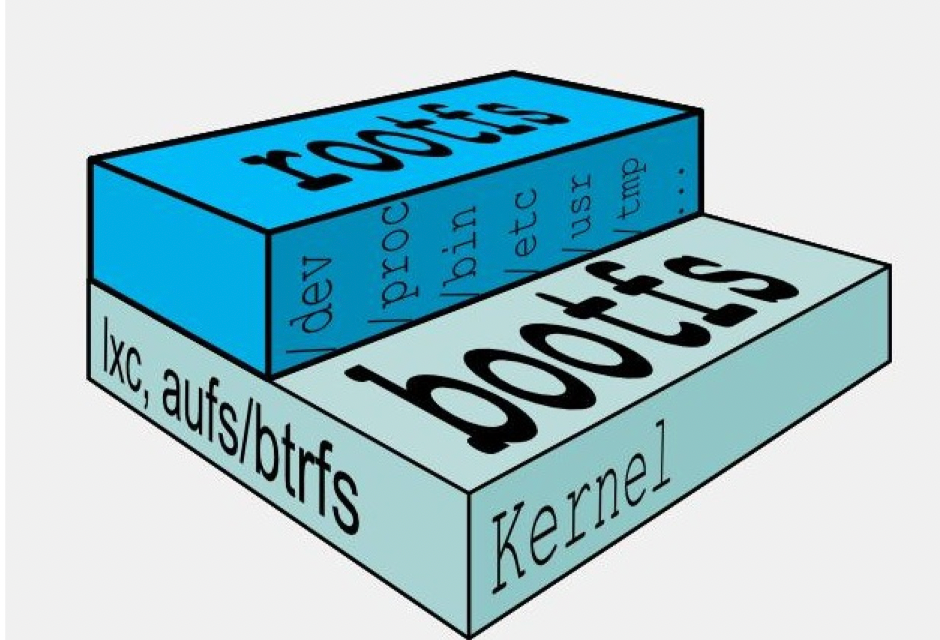
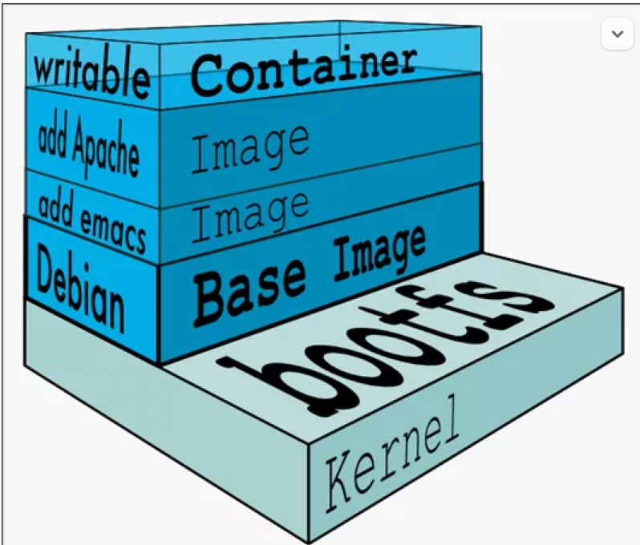

## UnionFS 联合文件系统

是一种分层、轻量级，并且高性能的文件系统，它支持**对文件系统的修改作为一次提交来一层层的叠加**，同时可以将不同目录挂载到同一个虚拟文件系统下。Union文件系统是Docker镜像的基础。

镜像可以通过分层来进行继承，基于基础镜像（没有父镜像）可以制作各种具体的应用镜像。

特性：

一次同时加载多个文件系统，但从外面看起来只能看到一个文件系统。联合加载会把各层文件系统叠加起来，这样最终的文件系统会包含所有底层的文件和目录 。

##  Docker 镜像加载原理

docker的镜像实际上由一层一层的文件系统组成，这种层级的文件系统UnionFS。 

bootfs(boot file system)主要包含bootloader和kernel, bootloader主要是引导加载kernel, Linux刚启动时会加载bootfs文件系统， 在**Docker镜像的最底层是引导文件系统bootfs**。 这一层与我们典型的Linux/Unix系统是一样的，包含boot加载器和内核。当boot加载完成之后整个内核就都在内存中了，此时内存的使用权已由bootfs转交给内核，此时系统也会卸载bootfs。 

rootfs (root file system) ，在bootfs之上 。包含的就是典型 Linux 系统中的 /dev, /proc, /bin, /etc 等标准目录和文件。rootfs就是各种不同的操作系统发行版，比如Ubuntu，Centos等等。 

 

对于一个精简的OS，rootfs可以很小，只需要包括最基本的命令、工具和程序库就可以了，因为底层直接用Host的kernel，自己只需要提供 rootfs 就行了。由此可见对于不同的linux发行版, bootfs基本是一致的, rootfs会有差别, 因此不同的发行版可以公用bootfs。 

## 为什么 Docker 镜像要采用这种分层结构

镜像分层最大的一个好处就是共享资源，方便复制迁移，就是为了复用。  

比如说有多个镜像都从相同的 base 镜像构建而来，那么 Docker Host 只需在磁盘上保存一份 base 镜像； 

同时内存中也只需加载一份 base 镜像，就可以为所有容器服务了。而且镜像的每一层都可以被共享。

## docker镜像层都是只读的，容器层是可写的

当容器启动时，一个新的可写层被加载到镜像的顶部。这一层通常被称作“容器层”，“容器层”之下的都叫“镜像层”。

所有对容器的改动 - 无论添加、删除、还是修改文件都只会发生在容器层中。只有容器层是可写的，容器层下面的所有镜像层都是只读的。 



## docker 镜像 commit 案例

```bash
docker run -it ubuntu bash
# 容器内
apt update -y && apt upgrade -y && apt install vim-nox -y
exit

# 容器外
# docker commit -m='提交信息' -a='作者' 容器ID 镜像名[:TAG]
docker commit -m='vim' -a='foo' f24b3f106d12 foo/vim
```

